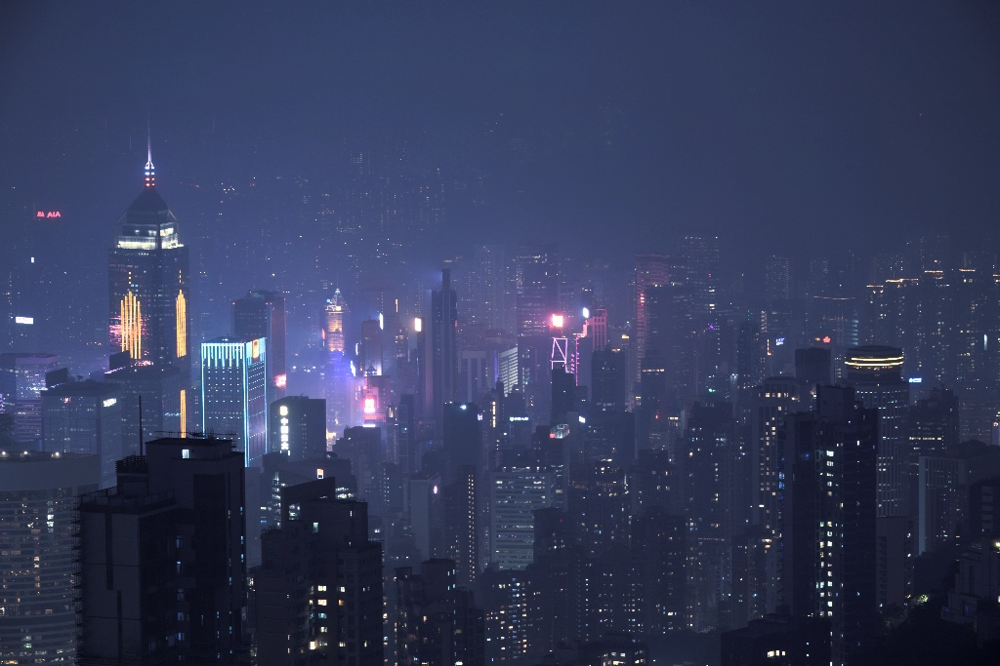
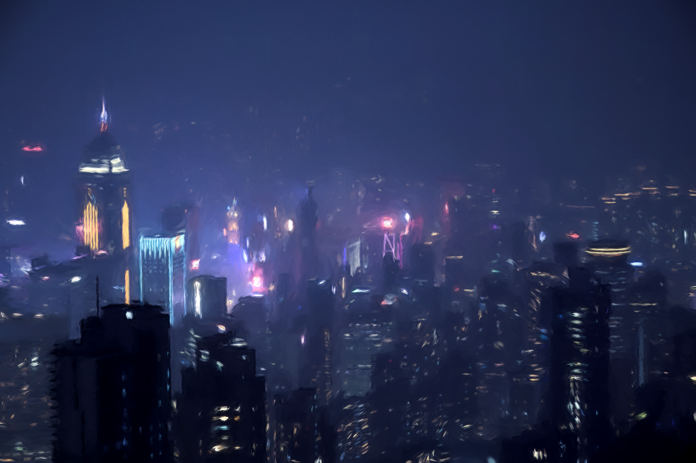
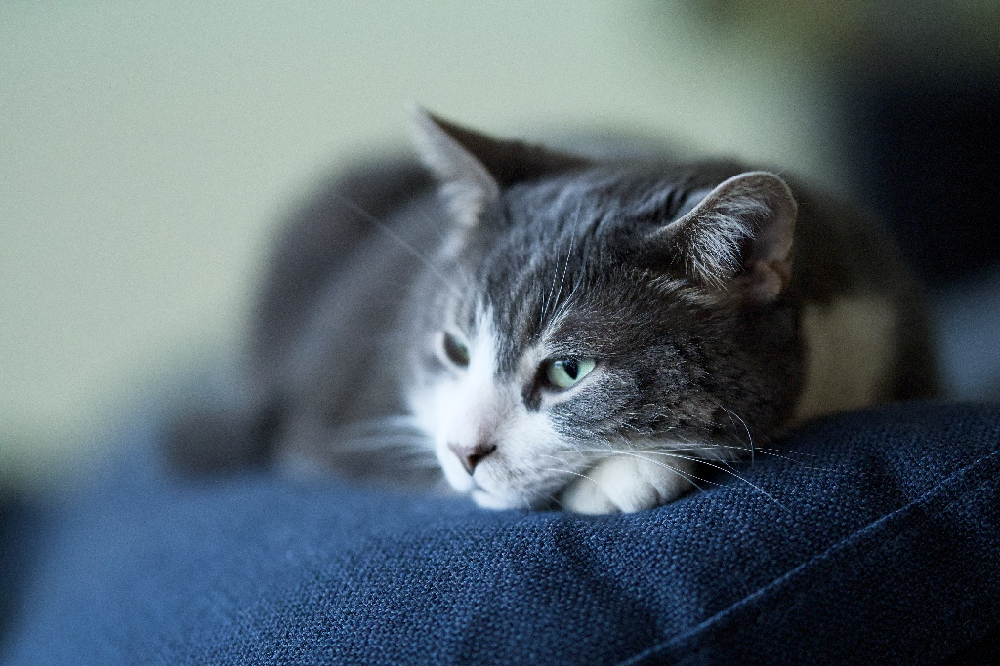

# splat-painter

A GUI tool that uses a field of 2D Gaussian splats to create an oil-painting
look built by progressive refinement. The painting starts wth an opaque underpainting
of large soft strokes, then successively finer, more translucent layers of brush strokes
traced along the image's edges.

Built in [Jolt](https://github.com/jolt-lang/jolt) (Clojure on Chez
Scheme) with [glimmer](https://github.com/jolt-lang/glimmer) (GTK4) and
[glimmer-gl](https://github.com/jolt-lang/glimmer-gl) (OpenGL).

The covariance math (Σ = R·diag(s²)·Rᵀ, closed-form 2×2 precision) follows the 2D
Gaussian splatting formulation of [DrawingWithGaussians](https://github.com/belkakari/DrawingWithGaussians)
and 3DGS.

## Examples

Each row below shows the source image, then the splat-painted result.

| Source | Splat-painted |
| --- | --- |
|  |  |
|  |  |
|  |  |
|  |  |

## How it paints

Analysis is done once per image load on the CPU, and this step takes a minute:

- **colour structure tensor** (Di Zenzo — per-channel Sobel, gamma-corrected) gives
  per-pixel edge orientation, coherence, and strength; chroma edges count like luma edges
- **Haar wavelet detail maps** at three scales (aggregate / mid bands / fine bands),
  luma-relative so dark regions keep their detail, fused with locally-normalized
  edge strength
- light + heavy blur colour fields

The rendering is done on the GPU using a vertex+geometry transform-feedback pass which turns
candidate positions into splats with up to seven coarse-to-fine levels. The base level
fully covers the image to ensure there are no gaps by construction. Then, each finer level
adds progressive details where its scale-matched detail map says so.
The broad tiers subdivide, while medium layers overlap and mix. Fine seeds trace brush strokes using 
chains of tapered gaussian segments is stepped along the edge tangent.
Making them ridge-snapped ensures that colour from the stroke's own side of the edge, fading out like a drying brush.
Mid levels make short translucent glazes while the finest levels are impasto liner strokes using long thin
lines at a couple-of-pixels width that follow contours inferred from the orientation field.

## Run

```sh
jolt -M:run                       # open the window, click "Open Image…"
jolt -M:run path/to/image.jpeg    # load an image immediately
```

Sliders (live):

- **Splats** — stroke budget (higher = finer, more faithful)
- **Size** — base stroke stdev in px; each finer level halves it
- **Broad** — bokeh dial: loosens only the LOW-detail regions (few large smooth
  daubs, thinned to keep coverage) while the wavelet-detected subjects keep their
  tight underpainting — smooth the background without touching the subject
- **Mid / Fine** — per-tier size multipliers for the mid/fine stroke levels
- **Detail** — how many finer levels are painted (up to seven)
- **Variation** — per-stroke size/tone jitter
- **Curvature** — Perlin bend of stroke traces (gated off on strong edges)
- **Swirl** — how much of the placement noise is the image-INDEPENDENT Perlin field.
  Two things ride on it: the flat-region flow that orients strokes where the tensor has
  no opinion, and the coherence (not the size) of the position warp that pushes seeds
  off the level lattice. At 1.0 (the default) both come from one smooth Perlin field, so
  neighbouring strokes turn and drift together — that is the organic look, and also what
  swims structure around in hazy, low-contrast regions where the detail map does not
  pin strokes down. At 0 the orientation comes from the edge-seeded flow (nearby edges
  voted into the flat areas) and the warp from each seed's own hash: the lattice still
  breaks, but nothing carries the photo's shapes with it. Coherent edges are unaffected
  either way — the tensor already owns those.
- **Stroke** — stroke length (chain step scaling)
- **Contrast** — per-channel contrast
- **Hardness** — edge crispness of detail strokes (tiny marks stay soft — antialiased)
- **Cut-in** — edge-band tier strength: restates silhouettes from their own sides, so
  a coat or hair against an out-of-focus background loses its grey fringe. 0 turns it
  off; the effect saturates around 1.0 (the default)

## Test & check

```sh
jolt -M:test      # unit + golden-field regression tests
jolt -M:check     # headless: shader GLSL structure, packing, full pipeline
jolt -M:preview   # CPU render to PNG (no GL needed)
jolt -M:prof      # analysis/placement profiling
jolt -M:pin       # print the golden fixture's actual checksums (for re-pinning)
```

Dev/debug entry points live under `test/`; only the app ships from `src/`.

Headless overrides (for scripting/testing): `GA_PAINTER_SAVE_PNG`,
`GA_PAINTER_QUIT_MS`, `GA_PAINTER_COUNT`, `GA_PAINTER_SIZE`, `GA_PAINTER_DETAIL`,
`GA_PAINTER_STROKE`, `GA_PAINTER_VAR`, `GA_PAINTER_BROAD/MID/FINE`, `GA_PAINTER_CUTIN`,
`GA_PAINTER_SWIRL`,
`GA_PAINTER_CPU_GEN` (CPU reference path), `GA_PAINTER_GPU_VERIFY`,
`GA_PAINTER_LOOP_RENDER`, `GA_PAINTER_TF_SMOKE`.

## REPL-driven development

`jolt nrepl-server` (default port 7888, writes `.nrepl-port`) resolves `deps.edn`
and parks the main thread on a pump, so an eval can start the GTK loop and jolt
marshals the blocking main loop onto the main thread. Connect any editor / nREPL client:

```clojure
(require 'splat-painter.core)
(splat-painter.core/-main "img/street.jpg")   ; window opens; this returns

;; the control atoms are the sliders — reset! one like a drag:
(reset! splat-painter.core/broad-atom 2.5)
;; GTK is single-threaded: marshal the re-render (any widget/GL touch) onto the
;; main loop. Plain data (the atoms) is fine to touch from the REPL thread.
(glimmer.core/on-gui #(#'splat-painter.core/request-render!))

;; hot-reload: redefine a fn/def and the next render uses it, no restart —
(alter-var-root #'splat-painter.seed/splat-budget (constantly 300000))
(glimmer.core/on-gui #(#'splat-painter.core/request-render!))
```

`glimmer.core/reload!` re-renders the mounted panel after you redefine the `app`
component. Quit through the app (close from its own menu / auto-quit) rather than
destroying the window from the REPL.

## Build

A standalone binary (no `jolt` needed to run it) is compiled with `jolt build`:

```sh
jolt build -m splat-painter.core -o splat-painter --opt
./splat-painter path/to/image.jpeg
```

The binary dlopens GTK4, OpenGL, and gdk-pixbuf at runtime, so those must be
installed on the target — `brew install gtk4 gdk-pixbuf` on macOS,
`apt install libgtk-4-1 libgdk-pixbuf-2.0-0` on Linux. macOS binaries are unsigned;
clear quarantine before first run with `xattr -d com.apple.quarantine ./splat-painter`.

Prebuilt binaries for macOS (arm64) and Linux (x86_64) are attached to each
[tagged release](https://github.com/yogthos/splat-painter/releases); the
`release` GitHub Actions workflow builds them when a `v*` tag is pushed.

## Dependencies

Glimmer and glimmer-gl are git deps pinned in `deps.edn`. gdk-pixbuf (image decode)
is declared as a `:jolt/native` lib. GTK4/OpenGL/GLib come in transitively.
